# 🎯 Kaiwa v2: 7-Day MVP Launch Strategy

> **Core Philosophy**: Ship the magic in 7 days. One perfect conversation experience beats ten half-built features.

[]()
[]()
[]()
[]()

---

## 🚀 The Radical MVP: Day 1-2

### ✨ **What We're Building First**

```mermaid
flowchart LR
    A[👥 User opens page] --> B[📱 Clicks one button]
    B --> C[💬 Has conversation]
    C --> D[✨ Feels magic]
```



**That's it.** No auth, no menus, no settings. **Just pure conversation.**

### 🎯 The One-Button Experience

| Step | User Action            | System Response             | Emotion    |
| ---- | ---------------------- | --------------------------- | ---------- |
| 1    | Opens page             | Beautiful, simple interface | 😌 Calm    |
| 2    | Clicks button          | Starts recording instantly  | 😊 Engaged |
| 3    | Speaks naturally       | AI responds intelligently   | 🤩 Amazed  |
| 4    | Continues conversation | Seamless back-and-forth     | ✨ Magical |

### **The Kernel Experience**

```svelte
<!-- This is your ENTIRE app on Day 1 -->
<script lang="ts">
 let isRecording = $state(false);

 async function toggleConversation() {
  if (!isRecording) {
   // Start recording
   const stream = await navigator.mediaDevices.getUserMedia({ audio: true });
   // ... minimal logic
   isRecording = true;
  } else {
   // Stop and process
   isRecording = false;
  }
 }
</script>

<button onclick={toggleConversation}>
 {isRecording ? '⏹️ Stop' : '🎤 Start Speaking'}
</button>
```

## 📊 7-Day Sprint Plan

> **🎯 Sprint Philosophy**: Each 2-day sprint delivers a complete, working experience.

### 🔥 **Day 1-2: The Kernel**

**🎯 Goal**: Working conversation loop

#### 📦 Deliverables

- ✅ Audio recording works flawlessly
- 🤖 AI responds intelligently to user
- 🔊 Response plays back clearly
- 📱 Beautiful UI with one button

#### 🏆 Success Metric (Day 1-2)

**Can have a real, meaningful conversation**

### ✨ **Day 3-4: The Experience**

**🎯 Goal**: Make it feel magical

#### 📦 Deliverables

- 🎨 Beautiful, responsive UI that delights
- 🌊 Smooth animations that feel natural
- 🚦 Clear status indicators (never confusing)
- 📜 Conversation history display

#### 🏆 Success Metric

**Users say "wow" on first use**

### **Day 5-6: The Enhancement**

**Goal**: Add persistence and identity (optional)

```typescript
// Deliverables:
- [ ] Optional Google sign-in
- [ ] Save conversations (fallback to localStorage)
- [ ] Basic progress tracking
- [ ] 2-minute trial for anonymous users

// Success Metric: Users can return and continue
```

### **Day 7: The Launch**

**Goal**: Get it in users' hands

```typescript
// Deliverables:
- [ ] Deploy to production
- [ ] Simple landing page
- [ ] Analytics setup
- [ ] Share with 10 beta users

// Success Metric: Real users having real conversations
```

## 🎨 Design Principles for MVP

### **Radical Simplicity**

- One button to start
- No configuration needed
- No sign-up required initially
- Works on first click

### **Progressive Disclosure**

```
Minute 1: User has first conversation
Minute 5: User discovers they can see history
Minute 10: User invited to sign in to save progress
Day 2: User discovers advanced features
```

### **Mobile-First**

- Must work perfectly on phone
- Touch-friendly buttons
- No complex gestures
- Fast on 3G

## 📱 Technical Shortcuts (That Are Actually Better)

### **Use Browser APIs**

```javascript
// Don't build what browsers provide
const recognition = new webkitSpeechRecognition(); // For backup
const synth = window.speechSynthesis; // For backup
const audio = new AudioContext(); // For audio processing
```

### **Start with CDNs**

```html
<!-- Day 1: Just use CDNs -->
<script src="https://cdn.tailwindcss.com"></script>
<!-- Move to build process after MVP -->
```

### **Local First**

```typescript
// Start with localStorage, add backend later
const storage = {
 save: (data) => {
  try {
   // Try backend
   await api.save(data);
  } catch {
   // Fallback to local
   localStorage.setItem('conversation', JSON.stringify(data));
  }
 }
};
```

## 🎯 Success Metrics

### **Day 2 Checkpoint**

- [ ] Can record audio
- [ ] Can get AI response
- [ ] Can play response
- [ ] Conversation loop works

### **Day 4 Checkpoint**

- [ ] UI is beautiful
- [ ] Feels smooth and responsive
- [ ] Works on mobile
- [ ] First user says "this is cool"

### **Day 6 Checkpoint**

- [ ] Can save progress
- [ ] Can sign in (optional)
- [ ] Deployed to production
- [ ] No critical bugs

### **Day 7 Success**

- [ ] 10 users tried it
- [ ] 5 users had full conversation
- [ ] 3 users came back
- [ ] 1 user shared it

## 🚫 What We're NOT Building (Week 1)

- ❌ Payment system
- ❌ Admin dashboard
- ❌ Multiple languages (start with English)
- ❌ Complex analytics
- ❌ Email notifications
- ❌ Social features
- ❌ Gamification
- ❌ Settings page
- ❌ User profiles
- ❌ API documentation

## 🏃‍♂️ Daily Standup Questions

1. **Is the conversation loop working?**
2. **What's blocking users from having a conversation?**
3. **What can we cut to ship today?**

## 💡 The 10x Simplification

Instead of:

```text
Landing → Sign Up → Onboarding → Settings → Try Feature → Maybe Convert
```

We're doing:

```text
Landing → Try Feature (2 seconds) → Love it → Maybe Sign Up
```

## 🚀 Post-MVP Roadmap (Week 2+)

Only after Week 1 success:

- Analytics and metrics
- Multiple language support
- Advanced features
- Payment integration
- Social features
- Gamification

## 🎯 The One Metric That Matters

**Week 1**: Number of completed conversations

Not signups. Not page views. Not time on site.
Just: **How many people had a real conversation?**

---

_Remember: Perfect is the enemy of shipped. Ship the conversation loop, then iterate._
