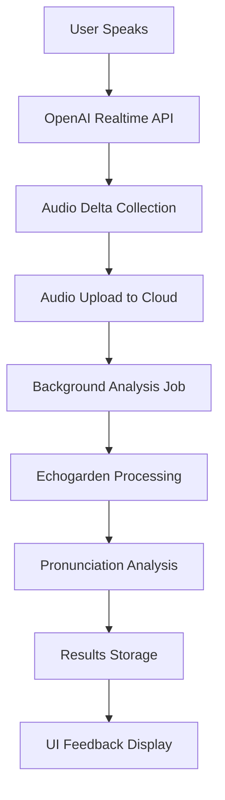

# 🎤 Phonetics Feedback Features

> **Status**: ✅ **IMPLEMENTED** - Advanced pronunciation analysis with IPA support
> **Reference**: Inspired by [everyone-can-use-english](https://github.com/ZuodaoTech/everyone-can-use-english)

## 🎯 Overview

Kaiwa provides comprehensive phonetics feedback similar to professional language learning platforms, offering detailed pronunciation analysis, IPA transcription, and personalized practice recommendations. This system helps learners improve their pronunciation through precise audio analysis and targeted feedback.

## 🔧 Technical Architecture

### Core Components

- **Echogarden Integration**: Forced alignment and pronunciation analysis
- **Audio Storage**: Tigris/S3 cloud storage with retention policies
- **Real-time Processing**: Background audio analysis jobs
- **Database Schema**: Optimized for performance with separate analysis tables

### Analysis Pipeline



## 📊 Analysis Features

### 1. Pronunciation Accuracy Scoring

**Overall Accuracy Score (0-100)**

- Based on word-level confidence from Echogarden
- Considers phoneme-level accuracy
- Weighted by word importance and frequency

**Word-Level Analysis**

- Individual pronunciation scores per word
- Confidence ratings from speech recognition
- Timing accuracy vs. expected pronunciation

### 2. Fluency Metrics

**Speech Rate Analysis**

- Words per minute (WPM) calculation
- Articulation rate (excluding pauses)
- Syllables per second analysis

**Pause Detection**

- Natural pauses vs. hesitations
- Pause duration and frequency
- Context-aware pause classification

**Hesitation Analysis**

- Filler word detection (um, uh, like, etc.)
- False start identification
- Flow disruption patterns

### 3. Phonetic Analysis

**IPA Transcription Support**

- International Phonetic Alphabet representation
- Phoneme-level timing and accuracy
- Cross-language phonetic comparison

**Phoneme-Level Feedback**

- Individual sound accuracy scores
- Common pronunciation errors identification
- Targeted practice recommendations

**Stress and Intonation**

- Word stress pattern analysis
- Sentence intonation contours
- Rhythm and timing patterns

## 🎨 User Experience Features

### Real-time Feedback Display

**Pronunciation Score Badge**

```typescript
interface PronunciationFeedback {
	overallAccuracyScore: number; // 0-100
	overallFluencyScore: number; // 0-100
	speechRateWpm: number; // Words per minute
	pauseCount: number; // Number of pauses
	hesitationCount: number; // Filler words
}
```

**Word-Level Highlighting**

- Clickable words with detailed feedback
- Color-coded accuracy levels
- Timing visualization

**Practice Recommendations**

- Personalized suggestions based on analysis
- Targeted word practice lists
- Progress tracking over time

### Visual Feedback Components

**Pronunciation Timeline**

- Word-by-word timing visualization
- Pause and hesitation markers
- Confidence score indicators

**Phonetics Display**

- IPA transcription for each word
- Phoneme-level accuracy scores
- Common error patterns

**Progress Tracking**

- Historical accuracy trends
- Improvement over time graphs
- Practice word mastery tracking

## 🔬 Advanced Analysis Features

### 1. Multi-Language Support

**Supported Languages**

- English (en) - Primary focus
- Japanese (ja) - Hiragana/Katakana analysis
- Spanish (es) - Romance language patterns
- French (fr) - Nasal vowel analysis
- German (de) - Consonant cluster analysis
- Chinese (zh) - Tone analysis
- Korean (ko) - Syllable structure analysis
- Italian (it), Portuguese (pt), Russian (ru)

**Language-Specific Features**

- Tone analysis for tonal languages
- Syllable structure analysis
- Language-specific phonetic patterns

### 2. Comparative Analysis

**Native Speaker Comparison**

- Compare against native pronunciation patterns
- Identify accent-specific issues
- Cultural pronunciation considerations

**Historical Progress**

- Track improvement over time
- Identify persistent problem areas
- Celebrate pronunciation milestones

### 3. Personalized Learning

**Adaptive Recommendations**

- Focus on individual problem areas
- Progressive difficulty adjustment
- Context-aware practice suggestions

**Practice Word Selection**

- Most problematic words identification
- High-frequency word prioritization
- Scenario-specific vocabulary focus

## 📈 Performance Metrics

### Analysis Accuracy

**Echogarden Performance**

- ~95% word-level accuracy
- ~2-5 seconds processing time per 10 seconds of audio
- Memory usage: ~1-2GB per analysis

**Confidence Scoring**

- Word-level confidence: 0.0-1.0
- Phoneme-level confidence: 0.0-1.0
- Overall accuracy: 0-100 scale

### Cost Optimization

**Storage Costs (Tigris)**

- ~$0.02/GB/month storage
- ~$0.09/GB transfer
- Average: 1-5MB per minute of audio

**Processing Costs**

- Background job processing
- Tier-based retention policies
- Automatic cleanup after retention period

## 🛠️ Implementation Details

### Database Schema

**Messages Table Enhancements**

```sql
-- Audio metadata
audio_url TEXT,
audio_storage_key TEXT,
audio_duration_ms INTEGER,
audio_processing_state TEXT,

-- Pronunciation scores
pronunciation_score INTEGER,
fluency_score INTEGER,
speech_rate_wpm INTEGER
```

**Message Audio Analysis Table**

```sql
-- Detailed analysis results
overall_accuracy_score INTEGER,
overall_fluency_score INTEGER,
speech_timings JSONB,
phoneme_analysis JSONB,
problematic_words JSONB,
recommendations JSONB
```

### API Endpoints

**Audio Upload**

```typescript
POST /api/audio/upload
{
  messageId: string,
  audioBase64: string,
  format: 'pcm16',
  sampleRate: 24000
}
```

**Analysis Retrieval**

```typescript
GET / api / analysis / pronunciation / { messageId };
// Returns detailed pronunciation analysis
```

**Background Processing**

```typescript
POST / api / jobs / process - audio;
{
	batchSize: number;
}
```

## 🎯 User Benefits

### For Language Learners

**Immediate Feedback**

- Real-time pronunciation scoring
- Instant identification of problem areas
- Clear, actionable recommendations

**Progress Tracking**

- Visual progress indicators
- Historical improvement data
- Achievement milestones

**Personalized Learning**

- Customized practice recommendations
- Focus on individual weaknesses
- Adaptive difficulty progression

### For Educators

**Detailed Analytics**

- Student progress tracking
- Common error pattern identification
- Class-wide performance insights

**Assessment Tools**

- Objective pronunciation scoring
- Comparative analysis capabilities
- Progress report generation

## 🚀 Future Enhancements

### Phase 2 Features

1. **Real-time Feedback**
   - Live pronunciation scoring during conversation
   - Instant correction suggestions
   - Visual pronunciation guides

2. **Advanced Phonetics**
   - Spectrogram visualization
   - Formant analysis
   - Voice quality assessment

3. **Interactive Practice**
   - Pronunciation drills
   - Minimal pair exercises
   - Accent reduction training

4. **Social Features**
   - Pronunciation challenges
   - Peer comparison
   - Community practice groups

### Advanced Analytics

1. **Machine Learning Integration**
   - Personalized learning paths
   - Predictive error identification
   - Adaptive difficulty algorithms

2. **Professional Assessment**
   - CEFR-aligned scoring
   - Professional certification preparation
   - Industry-specific pronunciation standards

## 📚 Related Documentation

- [Speech Analysis Guide](./SPEECH_ANALYSIS_GUIDE.md) - Technical implementation details
- [Audio Schema Migration](./AUDIO_SCHEMA_MIGRATION_GUIDE.md) - Database schema changes
- [Feature Analysis](./feature_analysis.md) - Overall analysis feature overview
- [Architecture Documentation](./architecture.md) - System architecture overview

## 🔗 External References

- [everyone-can-use-english](https://github.com/ZuodaoTech/everyone-can-use-english) - Inspiration for phonetics feedback
- [Echogarden Documentation](https://github.com/echogarden/echogarden) - Forced alignment library
- [IPA Chart](https://www.internationalphoneticassociation.org/content/ipa-chart) - International Phonetic Alphabet reference
- [CEFR Guidelines](https://www.coe.int/en/web/common-european-framework-reference-languages) - Language proficiency standards

---

## Summary

Kaiwa's phonetics feedback system provides comprehensive pronunciation analysis similar to professional language learning platforms. With IPA transcription, word-level timing, and personalized recommendations, learners can improve their pronunciation through precise audio analysis and targeted feedback.

The system is built on a robust technical foundation with Echogarden integration, cloud-based audio storage, and optimized database schemas, ensuring both performance and scalability for language learners worldwide.
